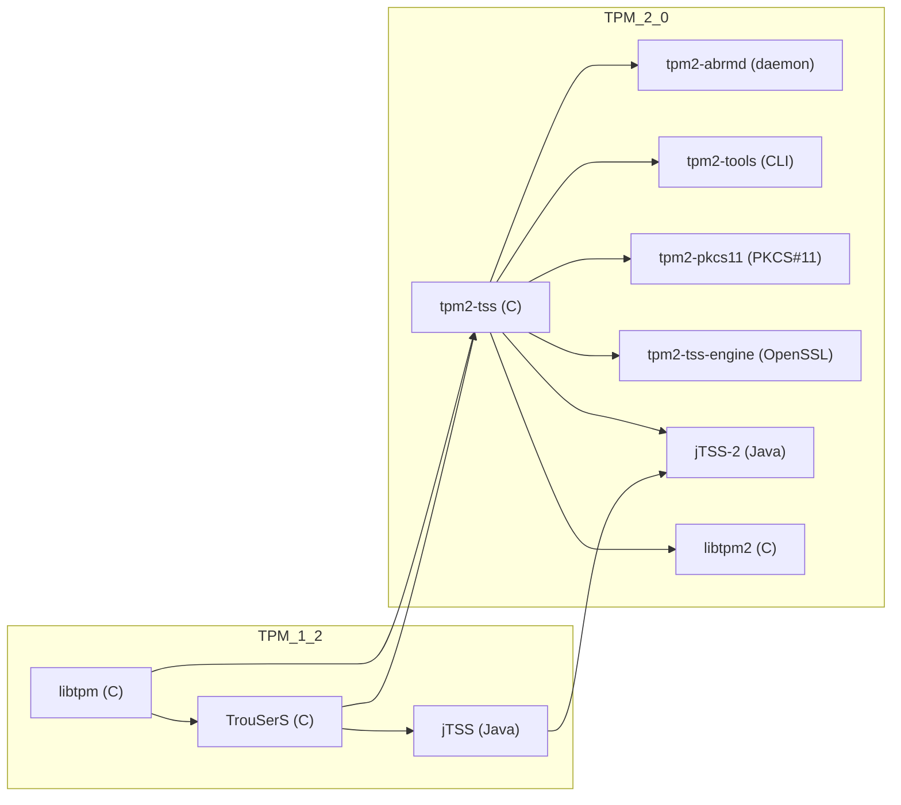

# TPM 软件栈工具发展关系表

## 表格概览

| 时代 | 工具 | 语言实现 | 主要职责 | 关键组件 / 守护进程 | 继任/衍生项目 | 备注 |
|------|------|----------|----------|-------------------|----------------|------|
| **TPM 1.2（早期）** | **libtpm** | C（静态/动态库） | 直接构造 TPM 命令报文、打开 `/dev/tpm0`（或 Windows 驱动）并发送 | 无守护进程，应用自行管理会话 | 为后续 **TrouSerS** 提供底层 API | 适合轻量、一次性操作；缺乏并发管理 |
| | **TrouSerS** (TCG TSS 1.2) | C / C++ | 完整的 **TSS**（Trusted Software Stack）实现，提供资源调度、对象上下文管理、会话复用 | **`tcsd`**（TPM Command Service Daemon）负责排队、上下文换入/换出 | 被 **tpm2‑tss**（ESAPI/SAPI/FAPI）取代，守护进程演化为 **`tpm2‑abrmd`** | 规模大、配置复杂，是 TPM 1.2 的事实标准 |
| | **jTSS** (Java TSS) | Java | 为 Java 应用提供 **TCG TSS 1.2** API（`TSS`、`TPM` 类），内部仍依赖 **TrouSerS** 的 `tcsd` | 通过 JNI/本地库调用 `tcsd` | 在 TPM 2.0 时代转向 **Java‑PKCS#11** 或 **tpm2‑tss‑engine** | 主要用于企业级 Java 项目 |
| **TPM 2.0（现代）** | **tpm2‑tss** (TCG TSS 2.0) | C | 重新设计的层次化 API： • **SAPI**（System API） • **ESAPI**（Enhanced） • **FAPI**（Feature） | **`tpm2‑abrmd`**（ABRMD：资源管理守护进程） （后被 **`tpm2‑resource‑manager`** 替代） | **tpm2‑tools**、**tpm2‑pkcs11**、**tpm2‑tss‑engine** 等基于此实现 | 支持 TPM 2.0 所有新特性（NV、Policy、ECC 等） |
| | **tpm2‑tools** | C | 命令行工具集合（`tpm2_create`, `tpm2_pcrread` …），直接调用 **tpm2‑tss** API | 无守护进程，直接与 TPM 设备交互（或通过 `tpm2‑abrmd`） | 为脚本化实验、CI/CD 提供便利 | 常用于实验、教学、快速原型 |
| | **tpm2‑pkcs11** | C | 将 TPM 2.0 作为 **PKCS#11** 软硬件模块，供 OpenSSL、GnuTLS 等使用 | 依赖 **tpm2‑tss** 与 **tpm2‑abrmd** | 与 **OpenSSL‑engine**、**tpm2‑tss‑engine** 互补 | 让现有 PKCS#11 应用无需改动即可使用 TPM |
| | **tpm2‑tss‑engine** (OpenSSL engine) | C | OpenSSL 引擎实现，使用 **tpm2‑tss** 进行密钥生成、签名、加解密 | 同上 | 与 **tpm2‑pkcs11** 形成双向桥梁 | 适合需要 OpenSSL API 的项目 |
| | **jTSS‑2** (Java TPM 2.0) | Java (via JNI) | Java 绑定 **tpm2‑tss**（ESAPI），提供原生 Java API | 通过 JNI 调用本地 **tpm2‑tss** 库 | 仍在社区维护中，逐步取代旧版 jTSS | 适合现代 Java 项目 |
| | **libtpm2** (轻量库) | C | 类似早期 **libtpm**，但针对 TPM 2.0 报文封装，提供简易 API | 无守护进程 | 为嵌入式/实验环境提供最小依赖 | 与 **tpm2‑tss** 并行存在 |

## 演化关系图（Mermaid）

## 快速参考（适用于 TCT 项目）

| 场景 | 推荐工具 | 使用理由 |
|------|----------|----------|
| **一次性读取 PCR / 简单命令** | `libtpm2`（或直接使用 `tpm2‑tools`） | 轻量、无需守护进程 |
| **需要并发会话、对象上下文管理** | `tpm2‑tss` + `tpm2‑abrmd` | 完整资源调度，适合长时间实验 |
| **Java 项目** | `jTSS‑2`（基于 `tpm2‑tss`） | 与现有 Java 代码无缝集成 |
| **使用 PKCS#11 接口的现有库** | `tpm2‑pkcs11` | 让 OpenSSL、GnuTLS 等直接使用 TPM |
| **需要 OpenSSL API** | `tpm2‑tss‑engine` | 在 OpenSSL 代码中调用 TPM |
| **脚本化实验、CI** | `tpm2‑tools` | 命令行即用，易于写 Bash/Python 脚本 |

---

如需在文档中引用此文件，只需在其他 Markdown 文件中使用 `[TPM 软件栈工具发展关系表](tpm_software_stack.md)` 即可。
